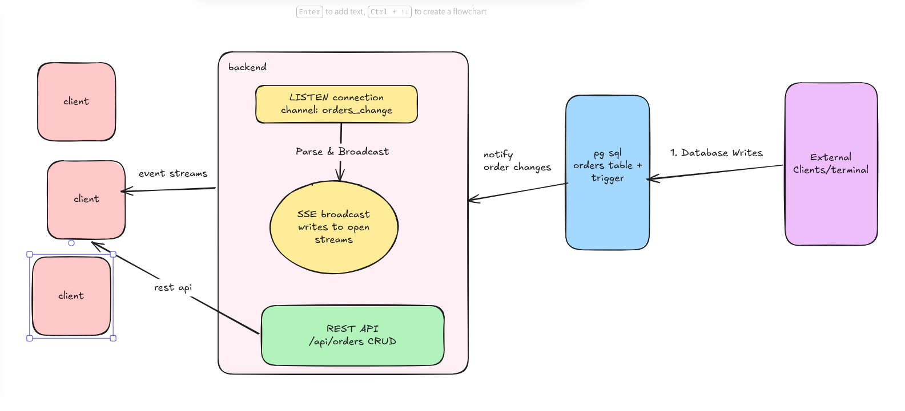

# Real-Time Order Updates System
** Architecture:**
`PostgreSQL (LISTEN/NOTIFY) → Node.js Backend → Server-Sent Events (SSE) → Browser Client`

A backend service that pushes live updates to connected clients the instant a
row in the `orders` table is inserted, updated, or deleted




---


### Data Flow (end to end)

1. A write happens on `orders` — via the REST API, `psql`, a script, or any other source.
2. PostgreSQL commits the transaction; the `AFTER` trigger fires and calls `pg_notify()`.
3. The backend's LISTEN connection receives the notification asynchronously.
4. The backend parses the JSON payload and calls `broadcast()`, writing the event to every connected SSE client.
5. Each browser's `EventSource.onmessage` fires, updating the order table live.

---


---

# Local Setup & Testing Guide

---

##  Prerequisites

- **Node.js**: v18.x or higher installed.
- **npm**: v9.x or higher installed.
- **Aiven Account**: Free tier or standard instance at [aiven.io](https://aiven.io).
- - I have pushed the env you can use my api key for testing

---

## 4. Installing & Starting the Application

1. Navigate to the `backend` directory:
   ```bash
   cd backend
   ```

2. Install dependencies:
   ```bash
   npm install
   ```

3. Start the application:
   ```bash

   npm run dev
   ```


5. Open the UI:
   - Open your browser to `http://localhost:3000` (open in 2 separate tabs or windows to observe multi-client synchronization).

---

##  Step-by-Step Testing Guide


### Method 1: Testing via CLI Database Queries (`npm run db:query`)

Run these commands in a separate terminal window from the `backend/` directory:

#### 1. View all orders
```bash
npm run db:query "SELECT id, customer, item, status FROM orders"
```

#### 2. Insert a new order
```bash
npm run db:query "INSERT INTO orders (customer, item, status) VALUES ('Test User', 'Test Product', 'pending')"
```
*Expected Result*: Watch your open browser tabs at `http://localhost:3000`—the new order will appear instantly in the order list without refreshing.

#### 3. Update an existing order
```bash
npm run db:query "UPDATE orders SET status = 'shipped' WHERE id = 1"
```
*Expected Result*: The status of order ID `1` updates to **shipped** across all open browser windows immediately.

#### 4. Delete an order
```bash
npm run db:query "DELETE FROM orders WHERE id = 2"
```
*Expected Result*: Order ID `2` is automatically removed from the live UI tables in real time.

---

# Design Choices

## 1. Why SSE design over other solutions?

I chose PostgreSQL LISTEN/NOTIFY with SSE because I designed the solution around the assignment requirements rather than using the most complex technology.

The requirement is to notify connected clients in real time whenever the `orders` table changes, without polling. PostgreSQL already provides an event mechanism through `LISTEN/NOTIFY`, and SSE efficiently streams those events from the server to connected clients.

Kafka is an excellent choice for large distributed systems, For a single service with one database and one notification service, that complexity isn't justified.

If the system later grows to many services, high event throughput, or requires durable event retention and replay, I would evolve the architecture to Kafka.

---

## 2. Why not WebSocket instead of SSE?

Updates only flow one way —> server to client. WebSockets are bidirectional and I don't need that. SSE is simpler, auto-reconnects natively, and works over plain HTTP.